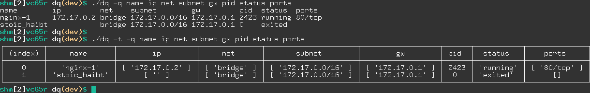

# :material-numeric-3-box-multiple: dq

Debugging a few docker containers is easy, but many no; we face challenges of finding
their IPs, GWs, names, etc. **dq** connects to Docker Engine API and shows data
in tabular style

## source code

It is available on [https://github.com/shakibamoshiri/dq](https://github.com/shakibamoshiri/dq)

## example

Here is a query to get some data form Docker Engine API and show them in a table

